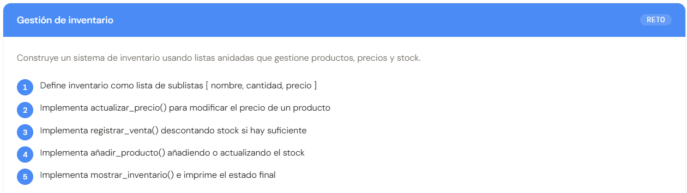
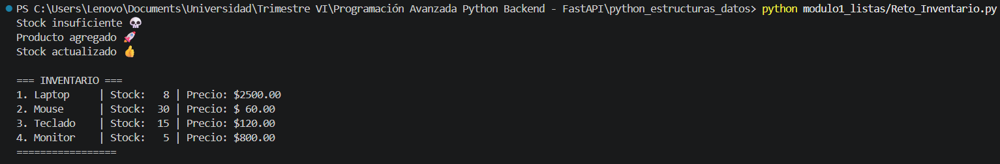
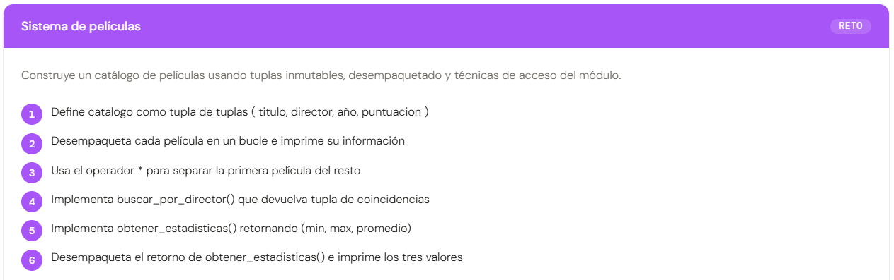
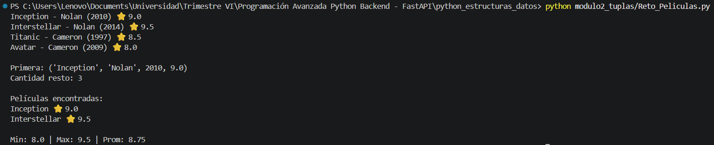
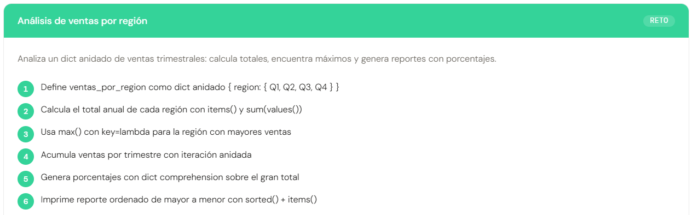
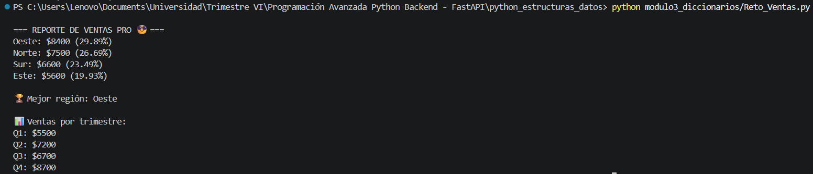
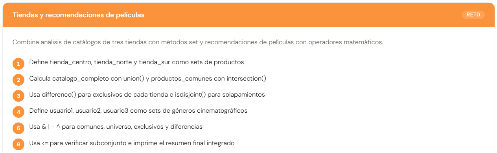
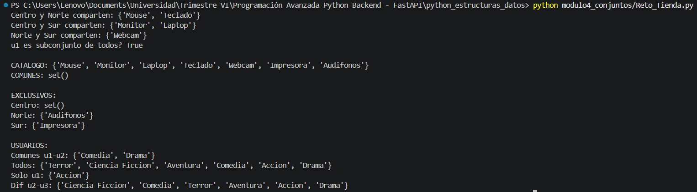
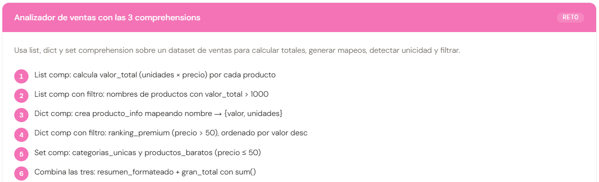
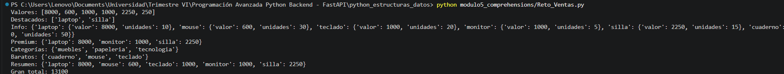

# Proyecto - Estructuras de Datos en Python

## Descripción
Este proyecto contiene el desarrollo de los módulos sobre estructuras de datos en Python: listas, tuplas, diccionarios, conjuntos y comprehensions.  
Incluye ejemplos prácticos y solución de retos propuestos en el material.

---

## Temas aprendidos
- Listas (colecciones mutables)
- Tuplas (inmutabilidad y desempaquetado)
- Diccionarios (clave → valor)
- Conjuntos (elementos únicos)
- Comprehensions (forma concisa y eficiente)

---

##  Evidencias por módulo

<details>
<summary>📂 Módulo 1: Listas</summary>

+ Codigo:

```python
# Inventario
inventario = [
    ["Laptop", 10, 2500],
    ["Mouse", 25, 50],
    ["Teclado", 15, 120]
]

# Buscar producto (helper simple con listas)
def buscar_producto(nombre):
    for item in inventario:
        if item[0].lower() == nombre.lower():
            return item
    return None

# Actualizar precio
def actualizar_precio(producto, nuevo_precio):
    item = buscar_producto(producto)
    if item:
        if nuevo_precio > 0:
            item[2] = nuevo_precio
        else:
            print("Precio inválido 😑")
    else:
        print("Producto no encontrado 🤡")

# Registrar venta
def registrar_venta(producto, cantidad):
    item = buscar_producto(producto)
    if item:
        if cantidad > 0:
            if item[1] >= cantidad:
                item[1] -= cantidad
            else:
                print("Stock insuficiente 💀")
        else:
            print("Cantidad inválida bro")
    else:
        print("Ese producto no existe 🥴")

# Añadir producto
def anadir_producto(producto, cantidad, precio):
    if cantidad <= 0 or precio <= 0:
        print("Datos inválidos 🚫")
        return

    item = buscar_producto(producto)
    if item:
        item[1] += cantidad
        print("Stock actualizado 👍")
    else:
        inventario.append([producto, cantidad, precio])
        print("Producto agregado 🚀")

# Mostrar inventario bonito
def mostrar_inventario():
    print("\n=== INVENTARIO ===")
    for i, item in enumerate(inventario, 1):
        print(f"{i}. {item[0]:<10} | Stock: {item[1]:>3} | Precio: ${item[2]:>6.2f}")
    print("=================\n")

# 🔥 Pruebas
actualizar_precio("mouse", 60)
registrar_venta("Laptop", 2)
registrar_venta("Laptop", 100)  # error
anadir_producto("Monitor", 5, 800)
anadir_producto("Mouse", 5, 50)
mostrar_inventario()
```

### Reto: Sistema de Inventario


**Descripción:**  
Se implementó un sistema de inventario usando listas anidadas para gestionar productos, precios y stock.

**Ejecución:** 

+ Codigo En La Terminal:

```python
python modulo1_listas/Reto_Inventario.py
```



</details>

---

<details>
<summary>📂 Módulo 2: Tuplas</summary>

+ Codigo:

```python
# Catálogo (tupla de tuplas)
catalogo = (
    ("Inception", "Nolan", 2010, 9.0),
    ("Interstellar", "Nolan", 2014, 9.5),
    ("Titanic", "Cameron", 1997, 8.5),
    ("Avatar", "Cameron", 2009, 8.0)
)

# 1. Mostrar catálogo
for titulo, director, año, puntuacion in catalogo:
    print(f"{titulo} - {director} ({año}) ⭐ {puntuacion}")

# 2. Separar primera del resto
primera, *resto = catalogo
print("\nPrimera:", primera)
print("Cantidad resto:", len(resto))

# 3. Buscar por director (más robusto)
def buscar_por_director(director):
    resultado = ()
    for peli in catalogo:
        if peli[1].lower() == director.lower().strip():
            resultado = resultado + (peli,)  # concatenar tuplas
    return resultado

# 4. Estadísticas (más seguro)
def obtener_estadisticas(peliculas):
    if len(peliculas) == 0:
        return 0, 0, 0

    puntuaciones = ()
    for peli in peliculas:
        puntuaciones = puntuaciones + (peli[3],)

    minimo = puntuaciones[0]
    maximo = puntuaciones[0]
    suma = 0

    for p in puntuaciones:
        if p < minimo:
            minimo = p
        if p > maximo:
            maximo = p
        suma += p

    promedio = suma / len(puntuaciones)

    return minimo, maximo, promedio

# 5. Pruebas
coincidencias = buscar_por_director("  nolan ")
if len(coincidencias) > 0:
    print("\nPelículas encontradas:")
    for titulo, director, año, puntuacion in coincidencias:
        print(f"{titulo} ⭐ {puntuacion}")
else:
    print("\nNo se encontraron películas 🤡")

minima, maxima, promedio = obtener_estadisticas(catalogo)
print(f"\nMin: {minima} | Max: {maxima} | Prom: {promedio:.2f}")
```

### Reto: Sistema de Películas


**Descripción:**  
Se desarrolló un catálogo de películas usando tuplas, aplicando desempaquetado y funciones de búsqueda.

**Ejecución:**  

+ Codigo En La Terminal:

```python
python modulo2_tuplas/Reto_Peliculas.py 
```



</details>

---

<details>
<summary>📂 Módulo 3: Diccionarios</summary>

+ Codigo:

```python
# 1. Datos
ventas_por_region = {
    "Norte":  {"Q1": 1500, "Q2": 2000, "Q3": 1800, "Q4": 2200},
    "Sur":    {"Q1": 1200, "Q2": 1700, "Q3": 1600, "Q4": 2100},
    "Este":   {"Q1": 1000, "Q2": 1400, "Q3": 1300, "Q4": 1900},
    "Oeste":  {"Q1": 1800, "Q2": 2100, "Q3": 2000, "Q4": 2500}
}

# 2. Totales por región (validando datos)
totales = {}
for region, datos in ventas_por_region.items():
    total = 0
    for trimestre, valor in datos.items():
        if isinstance(valor, (int, float)) and valor >= 0:
            total += valor
        else:
            print(f"Valor inválido en {region}-{trimestre} 🤨")
    totales[region] = total

# 3. Mejor región (evitar error si vacío)
if len(totales) > 0:
    mejor_region = max(totales, key=lambda r: totales[r])
else:
    mejor_region = None

# 4. Totales por trimestre (dinámico)
totales_por_trimestre = {}

for region, datos in ventas_por_region.items():
    for trimestre, valor in datos.items():
        totales_por_trimestre.setdefault(trimestre, 0)
        if isinstance(valor, (int, float)):
            totales_por_trimestre[trimestre] += valor

# 5. Gran total seguro
gran_total = sum(totales.values())

# 6. Porcentajes seguros (evita división por 0)
if gran_total > 0:
    porcentajes = {
        region: round((total / gran_total) * 100, 2)
        for region, total in totales.items()
    }
else:
    porcentajes = dict.fromkeys(totales.keys(), 0)

# 7. Reporte ordenado y limpio
print("\n=== REPORTE DE VENTAS PRO 😎 ===")

for region, total in sorted(totales.items(), key=lambda x: x[1], reverse=True):
    pct = porcentajes.get(region, 0)
    print(f"{region}: ${total} ({pct}%)")

if mejor_region:
    print("\n🏆 Mejor región:", mejor_region)
else:
    print("\nNo hay datos bro 💀")

print("\n📊 Ventas por trimestre:")
for t, v in sorted(totales_por_trimestre.items()):
    print(f"{t}: ${v}")
```

### Reto: Análisis de Ventas


**Descripción:**  
Se analizó un conjunto de datos de ventas usando diccionarios anidados, calculando totales y porcentajes.

**Ejecución:** 

+ Codigo En La Terminal:

```python
python modulo3_diccionarios/Reto_Ventas.py 
```



</details>

---

<details>
<summary>📂 Módulo 4: Conjuntos</summary>

+ Codigo:

```python
# 1. Tiendas
tienda_centro = {"Laptop", "Mouse", "Teclado", "Monitor"}
tienda_norte  = {"Mouse", "Teclado", "Audifonos", "Webcam"}
tienda_sur    = {"Laptop", "Monitor", "Impresora", "Webcam"}

# 2. Catálogo completo
catalogo_completo = tienda_centro.union(tienda_norte).union(tienda_sur)

# 3. Productos comunes
productos_comunes = tienda_centro.intersection(tienda_norte).intersection(tienda_sur)

# 4. Exclusivos
exclusivo_centro = tienda_centro.difference(tienda_norte.union(tienda_sur))
exclusivo_norte  = tienda_norte.difference(tienda_centro.union(tienda_sur))
exclusivo_sur    = tienda_sur.difference(tienda_centro.union(tienda_norte))

# 5. Verificar solapamientos
print("Centro y Norte comparten:", tienda_centro.intersection(tienda_norte))
print("Centro y Sur comparten:", tienda_centro.intersection(tienda_sur))
print("Norte y Sur comparten:", tienda_norte.intersection(tienda_sur))

# 6. Usuarios
usuario1 = {"Accion", "Comedia", "Drama"}
usuario2 = {"Comedia", "Terror", "Drama"}
usuario3 = {"Accion", "Ciencia Ficcion", "Aventura"}

# 7. Operaciones
comunes = usuario1 & usuario2
todos = usuario1 | usuario2 | usuario3
solo_u1 = usuario1 - usuario2
dif = usuario2 ^ usuario3

# 8. Subconjunto
print("u1 es subconjunto de todos?", usuario1 <= todos)

# 9. Reporte simple
print("\nCATALOGO:", catalogo_completo)
print("COMUNES:", productos_comunes)

print("\nEXCLUSIVOS:")
print("Centro:", exclusivo_centro)
print("Norte:", exclusivo_norte)
print("Sur:", exclusivo_sur)

print("\nUSUARIOS:")
print("Comunes u1-u2:", comunes)
print("Todos:", todos)
print("Solo u1:", solo_u1)
print("Dif u2-u3:", dif)
```

### Reto: Tiendas y Recomendaciones


**Descripción:**  
Se trabajó con conjuntos para analizar catálogos de productos y preferencias de usuarios.

**Ejecución:** 

+ Codigo En La Terminal:

```python
python modulo4_conjuntos/Reto_Tienda.py
```



</details>

---

<details>
<summary>📂 Módulo 5: Comprehensions</summary>

+ Codigo:

```python
# 1. Dataset
ventas = [
    {"producto":"laptop","unidades":10,"precio":800,"categoria":"tecnologia"},
    {"producto":"mouse","unidades":30,"precio":20,"categoria":"tecnologia"},
    {"producto":"teclado","unidades":20,"precio":50,"categoria":"tecnologia"},
    {"producto":"monitor","unidades":5,"precio":200,"categoria":"tecnologia"},
    {"producto":"silla","unidades":15,"precio":150,"categoria":"muebles"},
    {"producto":"cuaderno","unidades":50,"precio":5,"categoria":"papeleria"}
]

# 2. List comp: valor total
valores = [v["unidades"] * v["precio"] for v in ventas]

# 3. List comp con filtro
productos_destacados = [
    v["producto"]
    for v in ventas
    if v["unidades"] * v["precio"] > 1000
]

# 4. Dict comp: info
producto_info = {
    v["producto"]: {
        "valor": v["unidades"] * v["precio"],
        "unidades": v["unidades"]
    }
    for v in ventas
}

# 5. Dict comp con filtro (premium)
ranking_premium = {
    v["producto"]: v["unidades"] * v["precio"]
    for v in ventas
    if v["precio"] > 50
}

# 6. Set comp
categorias_unicas = {v["categoria"] for v in ventas}

# 7. Set comp con filtro
productos_baratos = {
    v["producto"]
    for v in ventas
    if v["precio"] <= 50
}

# 8. Resumen formateado
resumen_formateado = {
    v["producto"]: v["unidades"] * v["precio"]
    for v in ventas
    if v["unidades"] * v["precio"] > 500
}

# 9. Gran total
gran_total = sum(valores)

# 10. Prints simples
print("Valores:", valores)
print("Destacados:", productos_destacados)
print("Info:", producto_info)
print("Premium:", ranking_premium)
print("Categorías:", categorias_unicas)
print("Baratos:", productos_baratos)
print("Resumen:", resumen_formateado)
print("Gran total:", gran_total)
```

###  Reto: Analizador de Ventas


**Descripción:**  
Se utilizaron list, dict y set comprehensions para optimizar el análisis de datos.

**Ejecución:** 

+ Codigo En La Terminal:

```python
python modulo5_comprehensions/Reto_Ventas.py
```



</details>

---

## Reflexión final
Este proyecto permitió comprender el uso de diferentes estructuras de datos en Python y su aplicación práctica.  
Se fortaleció la lógica de programación y la capacidad de resolver problemas mediante estructuras eficientes.

